# Pickin' Trash - User Guide

## Introduction

**Pickin' Trash** is a community-driven volunteering platform designed to connect volunteers with environmental cleanup events. The platform serves two types of users:

- [**Volunteers**](#volunteer-user-guide) - Join events, earn points, track impact, and redeem rewards
- [**Organizers**](#organizer-user-guide) - Create and manage events, track volunteers, and make a positive difference in the community

Whether you're cleaning up beaches, forests, urban areas, or participating in climate action initiatives, Pickin' Trash makes it easy to organize or participate in environmental events.

---

# Volunteer User Guide

## Volunteer Introduction

As a volunteer, you can join events, earn points, track your impact, and redeem rewards while making a positive difference in your community. This guide will walk you through the essential features to get started as a volunteer.

---

## Getting Started

### 1. Sign Up / Sign In

When you first open the app, you'll see the login screen with two role options:
- **Volunteer** - Join events and earn points
- **Organizer** - Create and manage events

**To sign up as a volunteer:**
1. Tap **"Don't have an account? Sign Up"** at the bottom of the login screen.
2. Tap on **"Volunteer"** at the top of the signup screen 
3. Fill in your details:
   - Your full name
   - Email address
   - Password (minimum 6 characters)
   - Confirm password
4. Tap **"Create Account"**

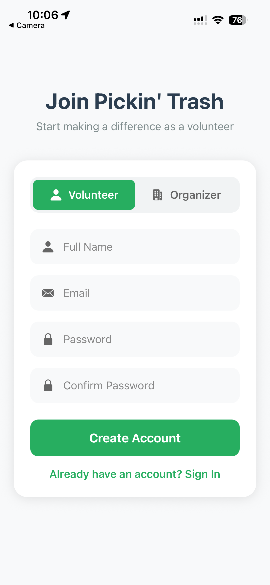

**To sign in:**
1. Make sure **"Volunteer"** is selected
2. Enter your email and password
3. Tap **"Sign In"**

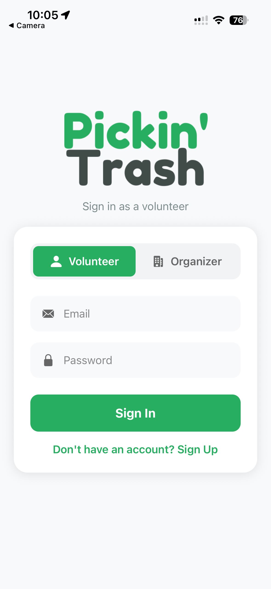

---

## Main Features

### 2. Home Screen Overview

After logging in, you'll land on the **Home** tab. Here you'll see:

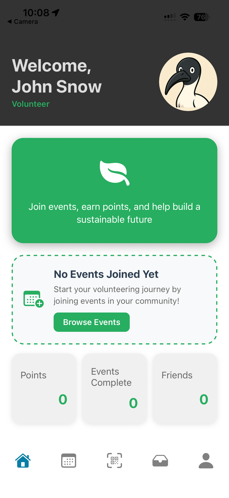

- **Green Banner** - Tap to browse available events
- **Next Event Card** - Shows your upcoming event (if you've joined any)
- **Stats Boxes** - Quick view of your Points, Events Completed, and Friends
  - Tap on **Points** or **Events Complete** to view your full profile and rewards
  - Tap on **Friends** to go to your inbox and manage friend requests

If you haven't joined any events yet, you'll see an encouragement card with a **"Browse Events"** button.

---

### 3. Browsing and Joining Events

To find and join events:

1. Navigate to the **Events** tab at the bottom
2. Browse through available events organized by category:
   - Urban, Beach, Forest, Ocean
   - Climate, Community, Education
   - Health, Wildlife, Conservation, Other

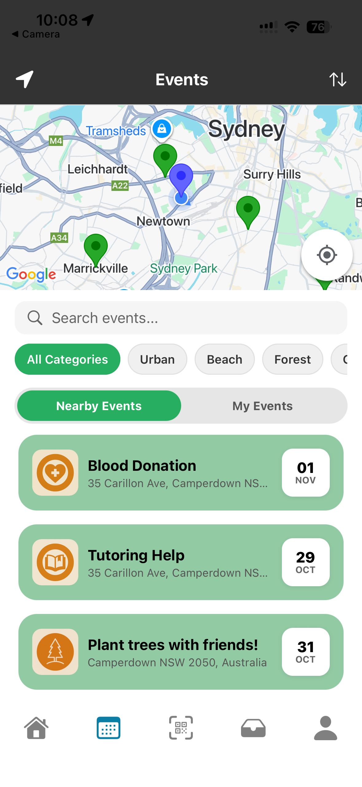

3. Tap on the sort icon on the top right corner to sort events list by distance or by date.

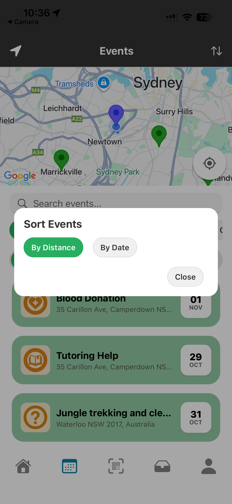

4. Tap on any event card to view details:
   - Event name and description
   - Date, time, and duration
   - Location and map
   - Points reward
   - Current volunteers count
   - Category

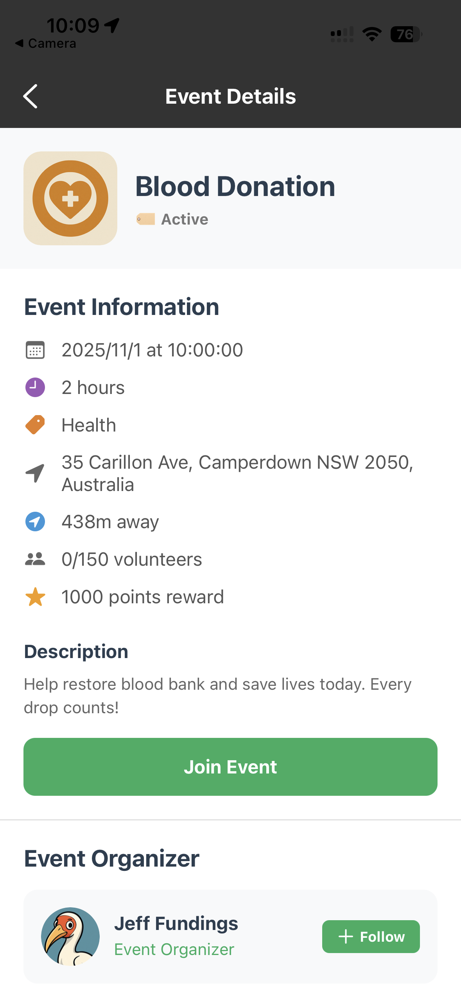

4. To join an event, tap the **"Join Event"** button
5. You'll receive a confirmation message and event details screen will be updated. You can also leave the event by tapping on "Leave Event" button.

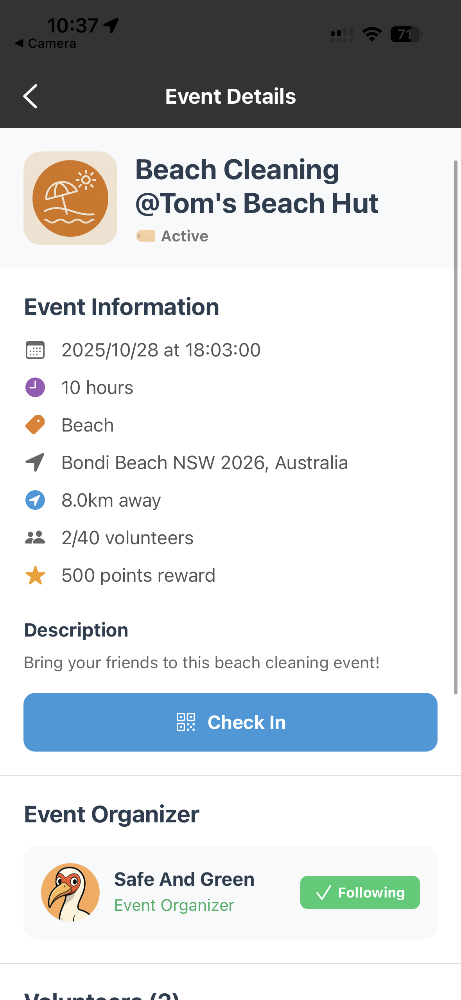

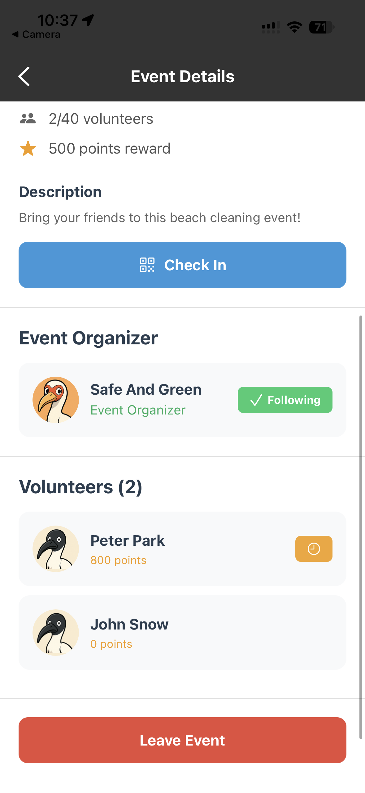

6. The event will now also appear in your **"Next Event"** card on the Home screen

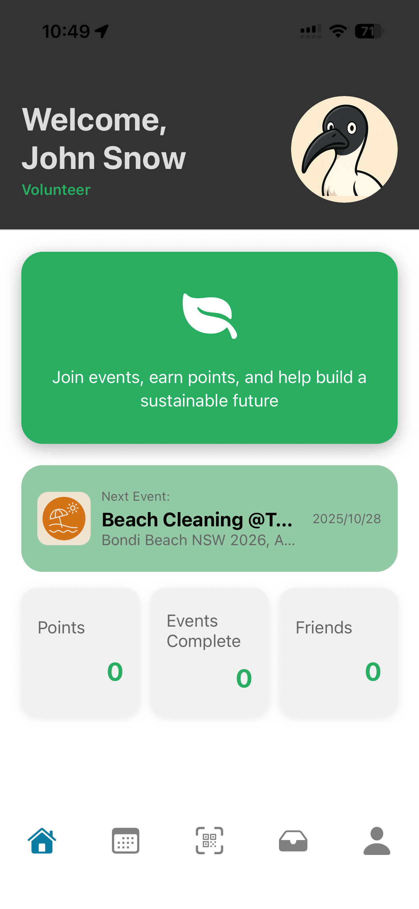

---

### 4. Checking In to Events

You have two ways to check in when you arrive at an event:

#### Method 1: QR Code Scan (Recommended)
1. Open the **Add** tab (camera icon)
2. Point your camera at the event's QR code
3. The app will automatically scan and check you in
4. You'll receive a confirmation alert

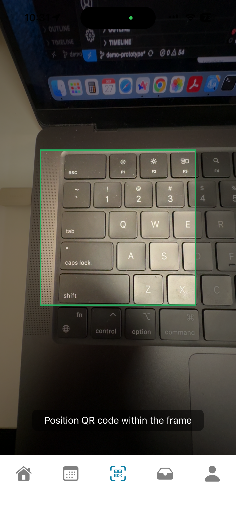

#### Method 2: Manual Check-In Code
1. Ask the organizer for the check-in code
2. Tap the **"Check In"** button on the event details page
3. Enter the check-in code
4. Submit to complete check-in

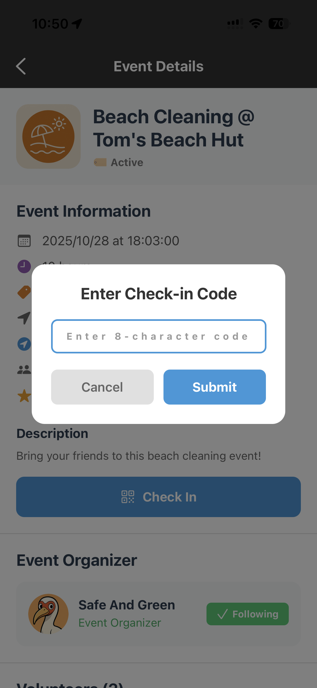

Once checked in successfully, you'll earn the points for that event!

---

### 5. Viewing Your Profile and Rewards

To see your stats, points, and redeemed rewards:

1. Tap on the **Profile** tab at the bottom
2. View your:
   - Total points
   - Avatar and personal information
   - Rewards available to redeem
   - Your redeemed rewards history
   - Event history

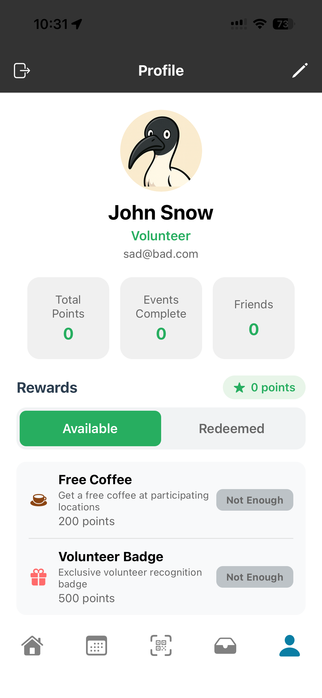

3. Edit your profile by tapping on the top right corner "pen" icon.

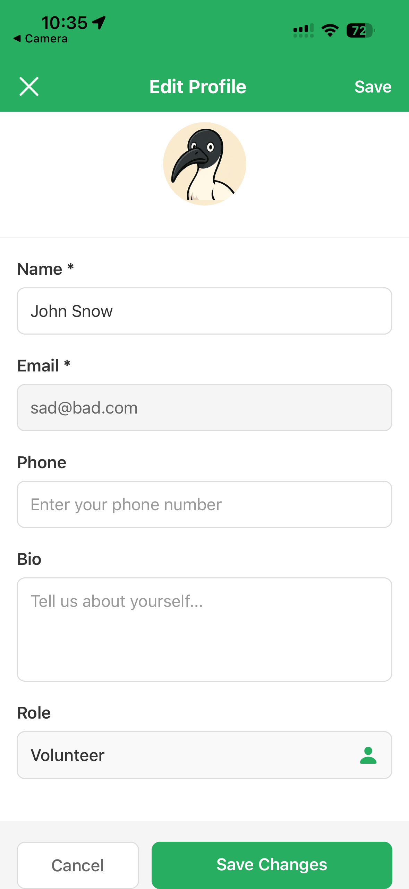

---

### 6. Connecting with Friends

To manage your friend network:

1. Navigate to the **Inbox** tab
2. Tap on the **"Friends"** tab (default)
3. You'll see:
   - Your current friends list
   - Start conversations with friends

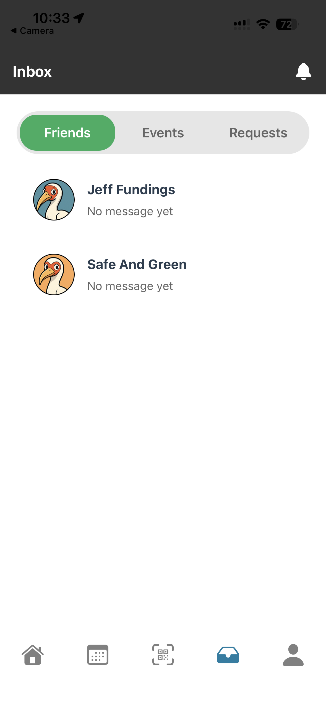

**To add a friend:**
1. Tap the **"Requests"** tab in Inbox
2. Send a friend request or respond to incoming requests
3. Check friend request status in others' user profile
3. Once accepted, you can chat with them

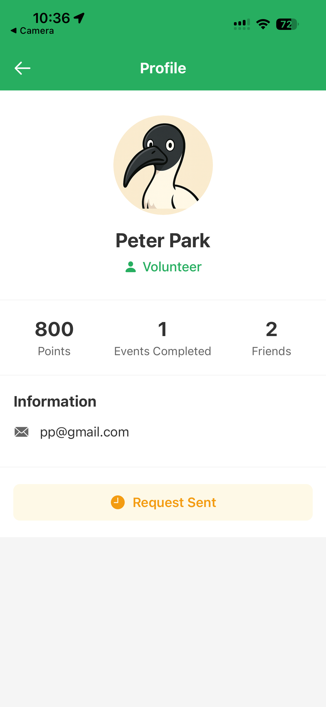

4. You can also accept or decline friend requests from others in the inbox tab.
   - Go to the **"Requests"** tab
   - Tap Accept button to accept the user as a friend and start chatting.
   - Tap Decline to not add them as a friend and they will not be able to send chats to you.

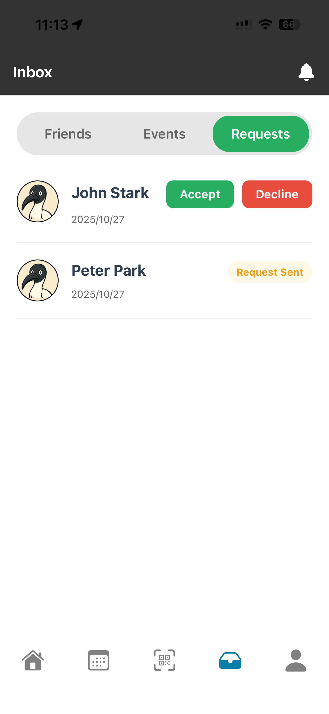

**Sending Messages:**
1. Tap on a friend from your friends list
2. Type your message
3. Send and have real-time conversations

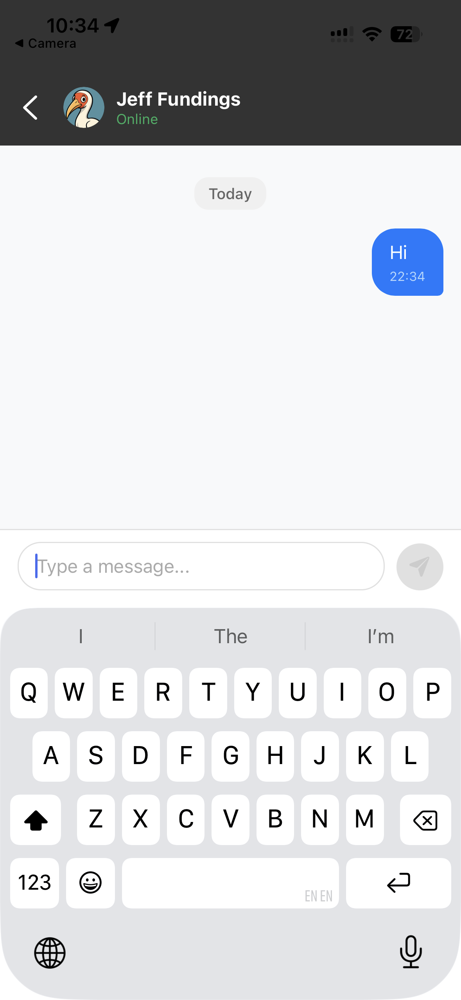

---

### 7. Event History

To view your past events:

1. Go to the **Profile** tab
2. Scroll down to the **"History"** section
3. See all events you've participated in, including:
   - Completed events
   - Points earned for each event
   - Organizer name and Date

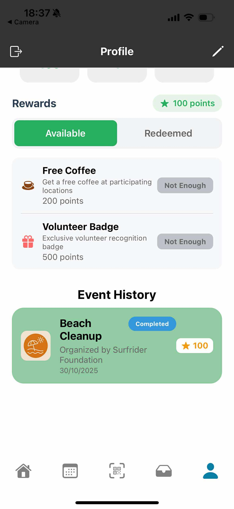

---

## Quick Tips

- **Earn Points**: Join events and check in to earn points that can be redeemed for rewards
- **Stay Updated**: Check the Home screen regularly to see your next upcoming event
- **Connect**: Add friends to share experiences and coordinate attending events together
- **Plan Ahead**: Join events in advance to ensure availability
- **Track Progress**: Monitor your impact through completed events count and total points

---

## Need Help?

If you encounter any issues or have questions:
- Check your internet connection
- Ensure you have camera permissions enabled for QR code scanning
- Contact the event organizer for event-specific questions
- Review your profile to verify points and event status

---

## App Navigation Summary

- **Home** 🏠 - Dashboard with your next event and stats
- **Events** 📅 - Browse and join available events
- **Add** 📷 - QR code scanner for event check-in
- **Inbox** 💬 - Messages and friend management
- **Profile** 👤 - Your stats, rewards, and event history

---

# Organizer User Guide

## Organizer Introduction

As an organizer, you can create environmental cleanup events, manage volunteers, track participation, and make a meaningful impact in your community. This guide will walk you through the essential features to get started as an event organizer.

---

## Getting Started

### 1. Sign Up / Sign In

When you first open the app, you'll see the login screen with two role options. To access organizer features:

**To sign up as an organizer:**
1. Tap on **"Organizer"** at the top of the login screen
2. Tap **"Don't have an account? Sign Up"** at the bottom
3. Fill in your details:
   - Organization name
   - Email address
   - Password (minimum 6 characters)
   - Confirm password
4. Tap **"Create Account"**

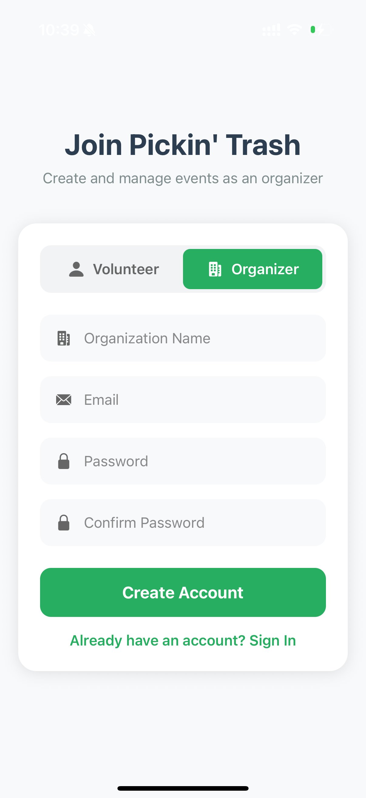

**To sign in:**
1. Make sure **"Organizer"** is selected
2. Enter your email and password
3. Tap **"Sign In"**

<!--  -->
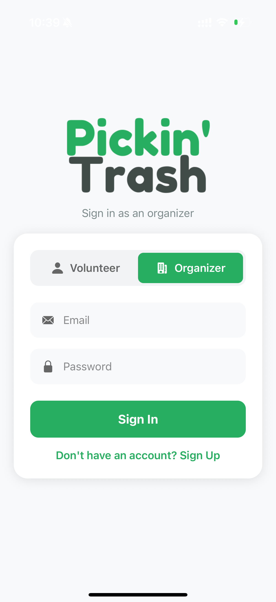

---

## Main Features

### 2. Home Screen Overview

After logging in as an organizer, you'll land on the **Home** tab. Here you'll see:

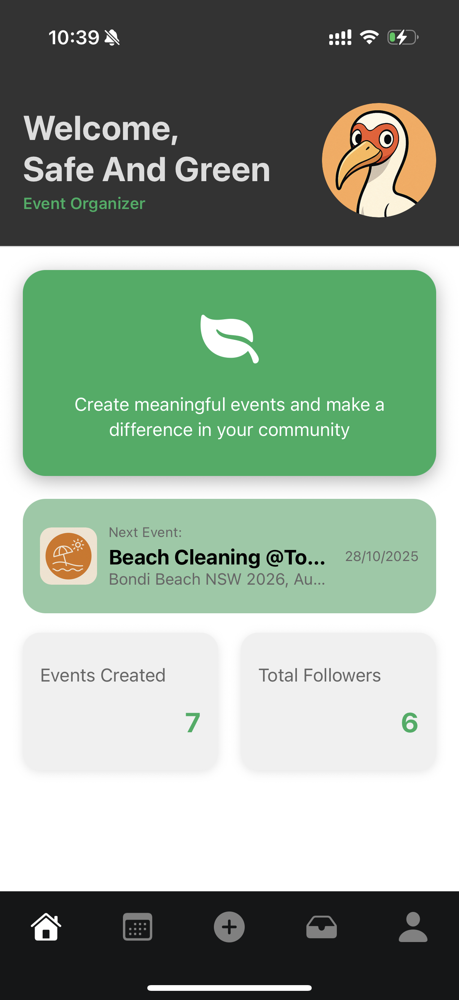

- **Green Banner** - Tap to create a new event
- **Next Event Card** - Shows your upcoming event (if you've created any)
- **Stats Boxes** - Quick view of Events Created and Total Followers
  - Tap on **Events Created** to view your full profile and event history
  - Tap on **Total Followers** to go to your inbox

If you haven't created any events yet, you'll see an encouragement card with a **"Create Event"** button.

---

### 3. Creating an Event

To create a new event:

1. Navigate to the **Add** tab at the bottom (or tap the green banner on Home)
2. Fill in the event details:
   - **Event Name** - Enter a descriptive name
   - **Description** - Describe what volunteers will be doing
   - **Category** - Select from Urban, Beach, Forest, Ocean, Climate, Community, Education, Health, Wildlife, Conservation, or Other
   - **Event Location** - Search for a location or tap on the map to set coordinates
   - **Event Date & Time** - Pick the date and time
   - **Duration** - Enter how many hours the event will last
   - **Max Volunteers** - Set the maximum number of volunteers
   - **Points Reward** - Set the points volunteers will earn

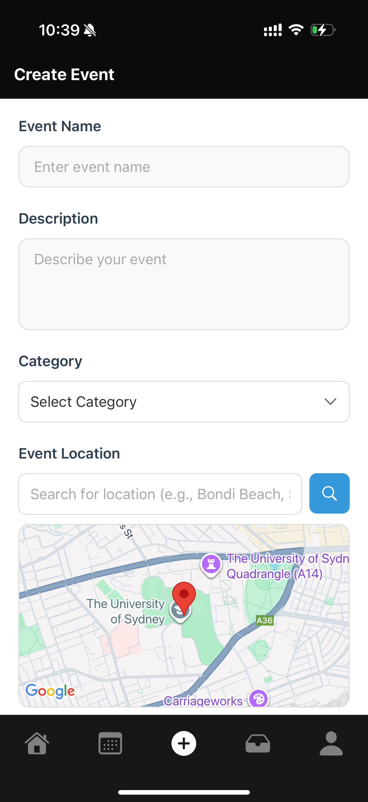
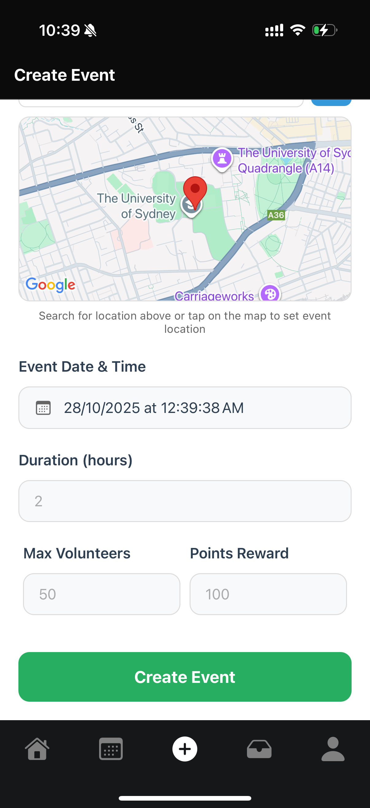

3. Tap **"Create Event"**
4. You'll receive a confirmation with a **Check-in Code** - save this code to share with volunteers
5. The event will now appear in your events list

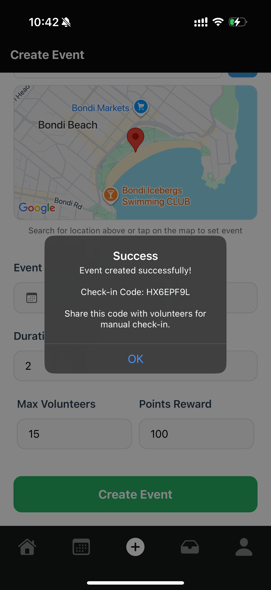

---

### 4. Managing Your Events

To view and manage your events:

1. Navigate to the **Events** tab
2. Click on **My Events** to see events organized by you
3. Tap on any event to view details and manage it

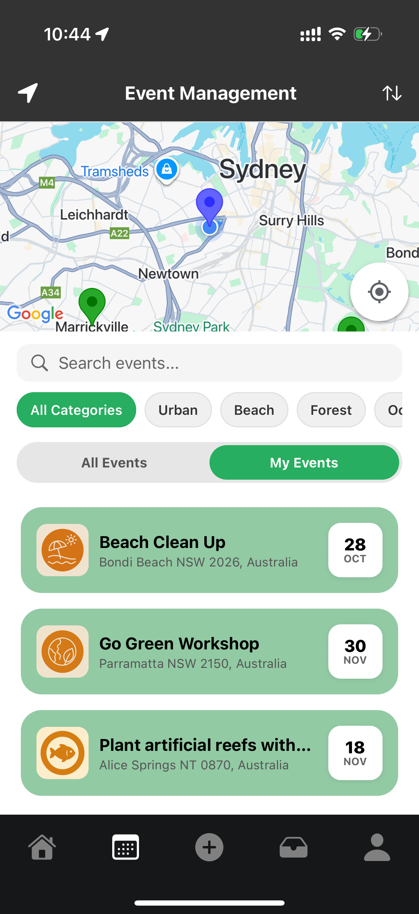

**Event Management Options:**
- View event details
- See list of volunteers who joined
- Edit event information
- Mark event as completed
- Cancel event if needed

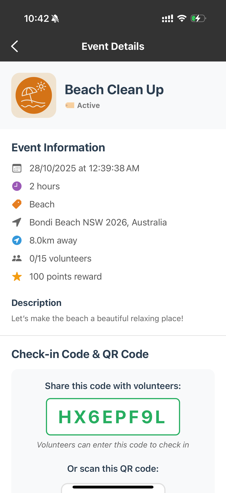
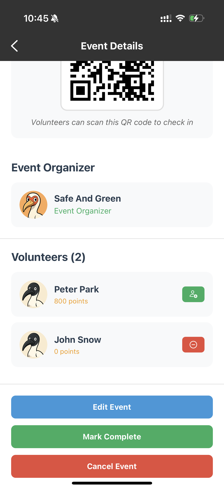
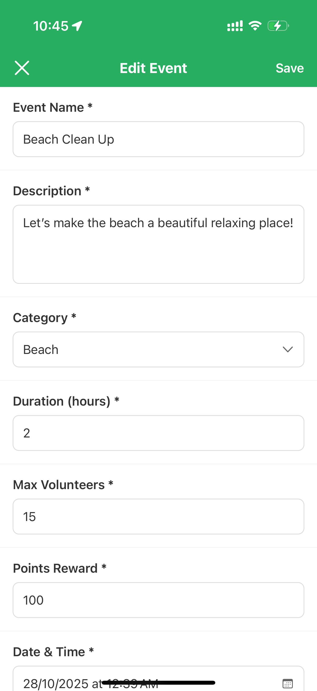
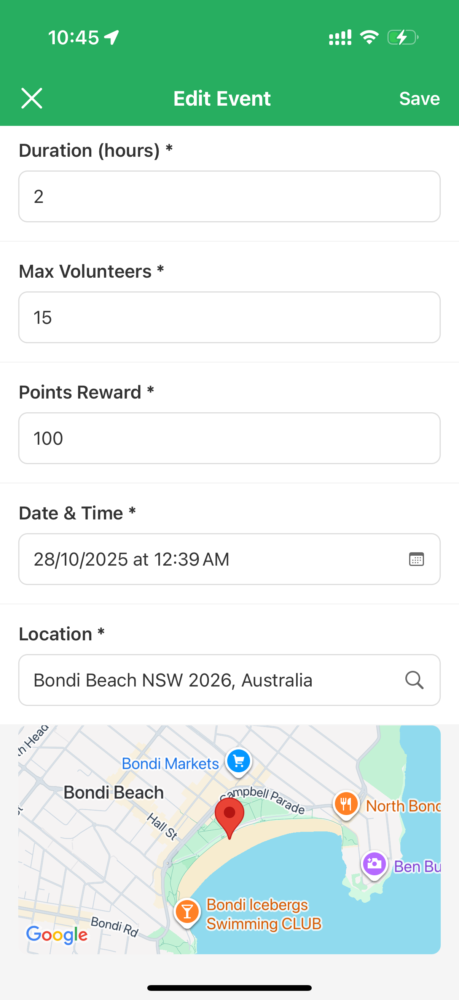
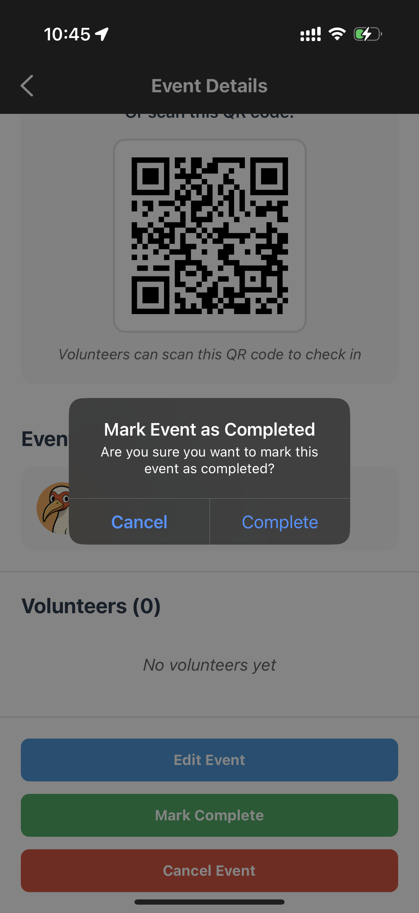
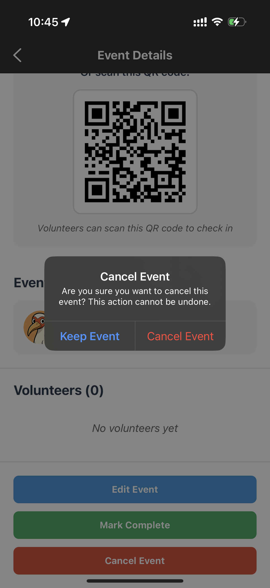

---

### 5. Viewing Event Participants

To see who has joined your events:

1. Go to the **Events** tab
2. Tap on any event to view details
3. Scroll to see the list of volunteers who have joined
4. You can see:
   - Volunteer names
   - Join status

---

### 6. Event Check-In Process

During your event, volunteers can check in using:

**Method 1: QR Code**
- Generate and display the QR code at your event
- Volunteers scan with their app

**Method 2: Manual Check-In Code**
- Share the check-in code with volunteers
- They enter it manually in the app

Both methods award points automatically to volunteers who have checked in successfully when you mark the event as complete.

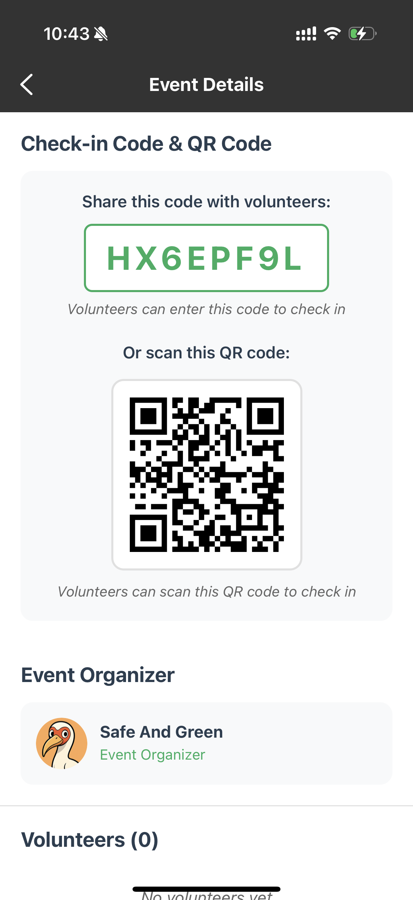

---

### 7. Viewing Your Profile and Statistics

To see your organizer statistics:

1. Tap on the **Profile** tab
2. View your:
   - Total events created
   - Total volunteers across all events
   - Event history with dates and locations
   - Each event's volunteer count

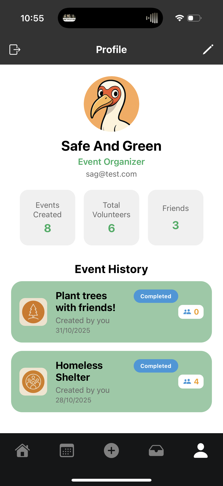

---

### 8. Managing Communications

To communicate with volunteers:

1. Navigate to the **Inbox** tab
2. Access three tabs:
   - **General Messages** - Communicate directly with your volunteers
   - **Event Messages** - Group Chats allowing for ease of communication to your event volunteers
   - **Friend Requests** - Manage friend requests

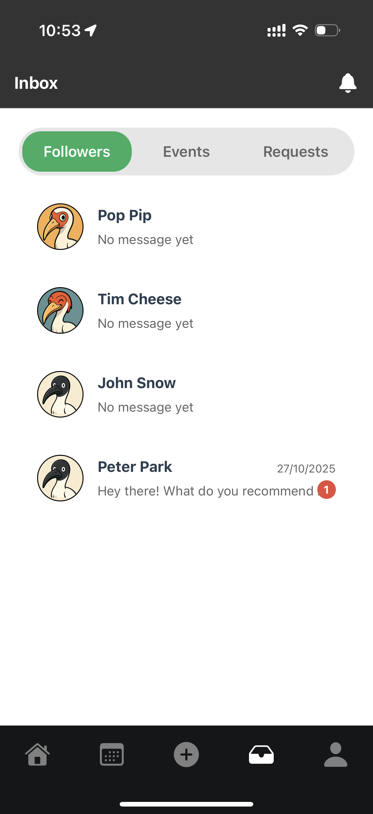
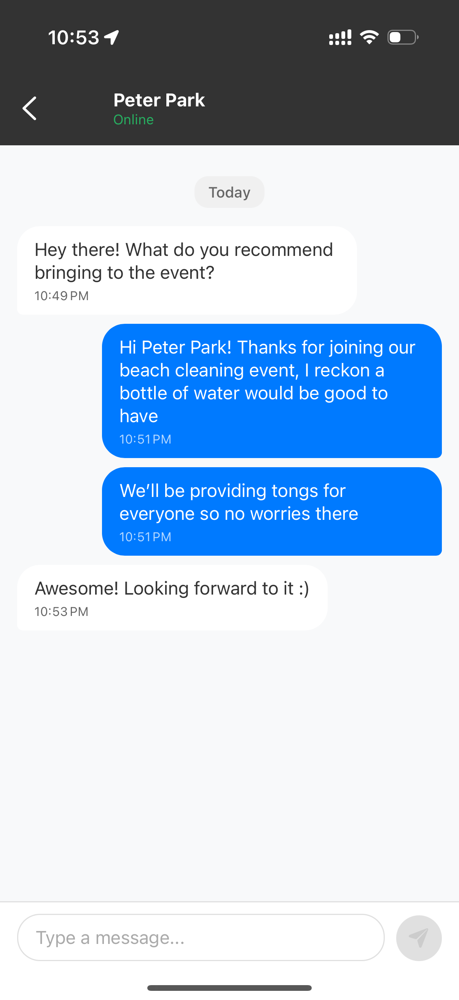
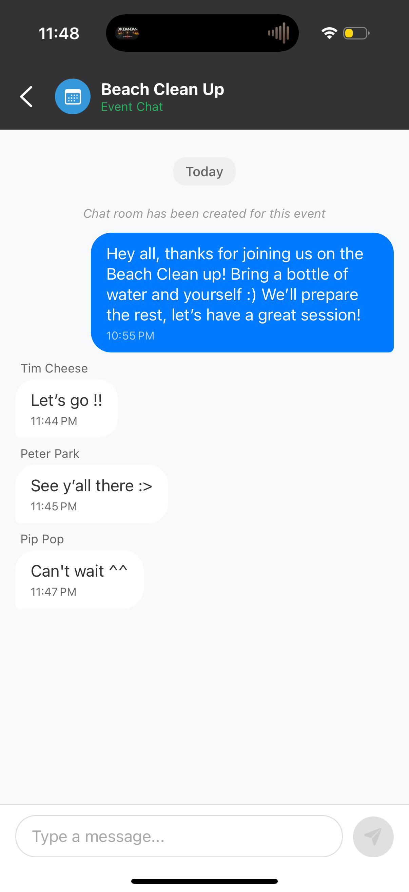

You can respond to questions, send event updates, and coordinate with other volunteers.

---

## Quick Tips for Organizers

- **Plan Ahead**: Create events at least 1 hour in advance
- **Clear Descriptions**: Provide detailed event descriptions to attract the right volunteers
- **Be Responsive**: Check your inbox regularly to answer volunteer questions
- **Track Impact**: Monitor your stats to see your community impact
- **Share Check-In Codes**: Have the check-in code ready at the event for smooth check-ins
- **Follow Up**: Mark events as completed after they finish

---

## Organizer App Navigation Summary

- **Home** 🏠 - Dashboard with your next event and stats
- **Events** 📅 - View and manage all your created events
- **Add** ➕ - Create new events
- **Inbox** 💬 - Messages and communications
- **Profile** 👤 - Your organizer stats and event history

---

